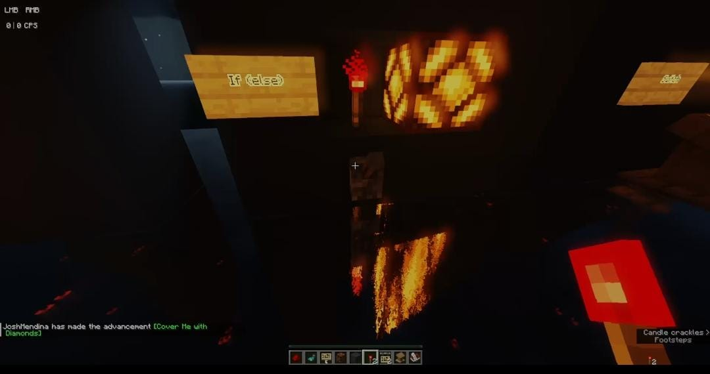

# Optativa2: explicación de ciclos de programación atravez de Minecraft
Team Chilemorron
Aldo Hernández Paz
Erick Eduardo Macías Rodriguez
Johana Guadalupe Barco Pacheco
Mariana Lizette Mendez Perez
Basándose en el mundo virtual que eligimos(,inecraft), se creo una experiencia interactiva donde los principios de los ciclos usados en programación se representaran de 
manera clara y explícita dentro del mundo virtual.
Lo más importante: el mundo debe ser autoexplicativo.
Cualquier persona que ingrese debe poder navegar y comprender los conceptos sin necesidad de una guía o instructor que le explique. 
Se debe centrar en crear una experiencia educativa inmersiva donde la representación visual y la organización del espacio para comunicar efectivamente el conocimiento.

---

## a) Representación Visual
### ¿Cómo decidieron representar cada concepto?
Usamos como elemento comun la redstone que se considera en minecraft como un conductor de energia, este fue usado de manera diferente en cada ciclo representado
Estos fueron: If, If else, Switch, for y while. todos esto fueron diferenciables atravez de un cartel y distanciados unos de los otros, todos ellos son ejecutables a base de palanca menos el while.
Donde el elemento que muestra de manera visual la forma de cada uno es atravez de lintarnas que seria lo que ven los jugadores y detraz de estos es donde se puso el redstone como las fuentes de energia.
### ¿Qué criterios usaron para el diseño visual?
* **Minimalismo:** Más que nada se implemento una visibilidad al usuario para que se vean los ciclos de manera frontal donde se planteo usar un solo objeto interactivo por ciclo para que se diera a entender de forma intuitiva.
* **Accesibilidad:** Teniendo encuenta que el unico señalamiento que se da es la señalación de cada ciclo y el hecho de que en minecraft para este tipo de mundos creados por otros jugadores, enta accesibilidad se basa en que el espacio creado para esto sea conocido y al mismo tiepo que se tengan las herremientaspara ejecutar minecraft.
  

### Justificación de sus decisiones de diseño
Se opto por un diseño simple sin tantos elementos pensando en no generar confución y teniendo como punto de apoyo el no dar más de un objeto interactivo por ciclo.
## ⚙️ b) Proceso de Desarrollo
### ¿Cómo construyeron el mundo?
Primero se planteo varios temas entre ellos la reprecentación de suma de vectores, o una claculadora y planteando diferentes formas de ejcutar cada uno se escojio representar los ciclos basicos en programación por lo que estos abarcan en la carrera y al mismo tiempo fue el que se considero más optimo para la optativa.
### ¿Qué herramientas utilizaron?
Elementos usados para la logica dentro de minecraft:
Linterna de Redstone
Plovo de Redstone
Comparador de Redstone
Repetidor de Redstone
Tolvas
Palancas
Panel solar
Pistones pegajosos
Observador
Dispensador
Antorcha de Redstone
### ¿Qué desafíos encontraron y cómo los resolvieron?
1. La representación de los ciclos fue en parte la mayor dificultad estose soluciono más que nada a base de prueba y error y de intentar diferentes ideas para la representación de los ciclos hasta encontar la más entendible.
2. La sintaxis y forma de juego de minecraft tambien resulto ser una dificultad para 2 o 3 integrantes tuvieron dificultad al intentar usar minecraft. Se decidio que una sola persona se encargara de hacer el mundo de minecraft y el trabajo restante se dividio entre los demas mienbros.
### Timeline del proyecto
* **Semana 1:** Propuestas y borradores antes de decidir un mundo virtual
* **Semana 2:** Pruebas en ambos mundos y mejora de las propuestas iniciales
* **Semana 3:** Se elige tema definitivo y se mejora segun las pruebas.
* **Semana 4:** Arreglos de estetica y logica inicio de la documentación
---
  
  ### Resumen de la Parte (d) - Control de Versiones
  Vesion utilizada: Minecraft 1.21.10 java
  Ip del servidor donde esta el mapa:iErickJaja-7ZY9.exaroton.me
  Se puede ingresar a este en cualquier momento.
